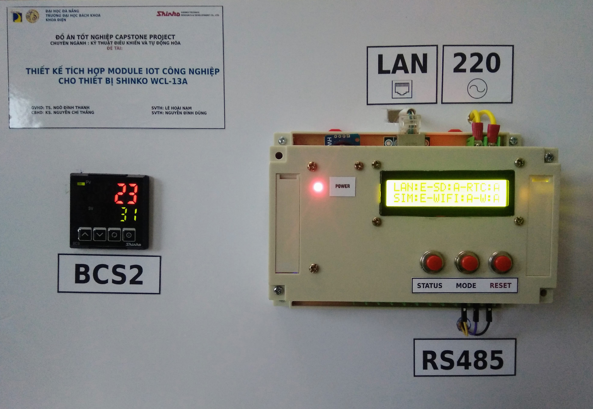

## PROJECT: Thiết kế tích hợp module truyền thông IoT công nghiệp cho thiết bị Shinko BCS2
 

---
## Công nghệ sử dụng
### HARDWARE
- Vi điều khiển ESP32
- Bộ điều khiển nhiệt độ Shinko BCS2
- Module: SIM, LAN, Nguồn,...
### SOFTWARE
- IDE: Arduino IDE
- Thư viện xây dựng webserver nhúng trên MCU ESP32 [ESPAsyncWebServer](https://github.com/me-no-dev/ESPAsyncWebServer)
---

## Yêu cầu đồ án
&nbsp;
<h2 align="center">PROJECT</h2>

> Thiết kế tích hợp module truyền thông IoT công nghiệp cho thiết bị Shino BCS2

- Điện áp ngõ vào 220VAC
- Kết nối Modbus-RTU thiết bị BCS2
- Chức năng log dữ liệu 4-20mA tại chỗ vào thẻ nhớ qua file 420mA *.txt
    - Thời gian lưu dữ liệu vào file txt cài đặt được 1 phút, 5 phút, 10 phút, 15
phút hoặc 20 phút/lần.
- Giao tiếp truyền nhận dữ liệu qua LAN/WIFI/4G (Dùng IC, Chip)
- Cấu hình thông số thiết bị qua webserver
- Chức năng gửi file dữ liệu 4-20mA *.txt qua giao thức FTP
    - Truyền dữ liệu theo phương thức FTP tới địa chỉ máy chủ FTP bằng tài
khoản và địa chỉ FTP do Shinko cung cấp
    - Dữ liệu được truyền về VPS có khoảng thời gian truyền cài đặt được 1
phút, 5 phút, 10,15 phút hoặc 20 phút/lần.
    - Cầu hình 2 tài khoản FTP
- Đọc File *.txt từ VPS
---

## Tính năng

 

#### Chức năng:
- Truyền thông theo giao thức RS-485 với thiết bị BCS2 để cấu hình và lấy dữ liệu từ thiết bị
- Cấu hình thiết bị và giám sát từ xa từ thiết bị thông minh (máy tính, điện thoại) thông qua giao diện web
- Tải file log từ cảm biến thiết bị lên server
- OTA Update: cập nhập firmware từ xa